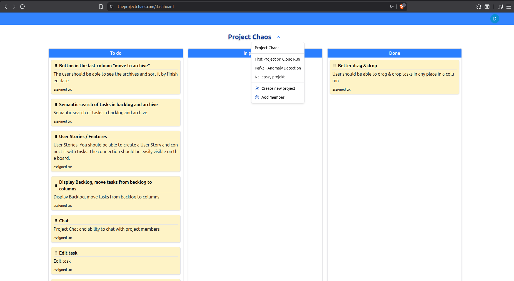

# Project Chaos

The Project Chaos is a Kanban-style task board (written in Spring Boot and Next.js).
It lets users organize tasks across columns, work with other people on shared projects, and assign different member roles to control access and responsibilities.

Backend Repository: https://github.com/stodolkiewicz/project-chaos-backend



## Commands

When running the project for the first time or when dependecies were added:
```bash
npm install
```

and then:
```bash
npm run dev
```

### Before deployment:
1. Comment out 
```
output: "standalone"
``` 
in next.config.js

2. Then,
```
npm run build
npx next start
```

3. Test application
4. Uncomment 

## Libraries

1. icons:  
   https://react-icons.github.io/react-icons/icons/fc/  
   https://lucide.dev/icons

2. tailwindcss  
   https://tailwindcss.com/

3. shadcn/ui  
   https://ui.shadcn.com/
   
   Adding new components:
   ```bash
   npx shadcn@latest add button
   npx shadcn@latest add dialog
   npx shadcn@latest add dropdown-menu
   ```
   
   Components are added to `/components/ui/` directory and are based on Radix UI primitives with Tailwind CSS styling.

4. React Redux  
   https://react-redux.js.org/

5. Redux Toolkit - recommended way of writing Redux  
   https://redux-toolkit.js.org/  
   Also includes RTK Query for data fetching and caching,

6. React Hook Form  
   https://react-hook-form.com/get-started

7. TipTap - Rich Text Editor  
   https://tiptap.dev/
   
   Using Minimal TipTap - A lightweight, customizable rich text editor component styled with Shadcn UI:  
   https://github.com/Aslam97/minimal-tiptap  
   https://shadcn-minimal-tiptap.vercel.app/

## Browser Extensions
1. React Developer Tools

2. Redux DevTools

## Useful Links

1. Convertico  
   Convert PNG to ICO  
   https://convertico.com/

### Docs, Blogs, tutorials, etc.

1. Redux - Complete Tutorial (with Redux Toolkit)
   https://www.youtube.com/watch?v=5yEG6GhoJBs

2. Query RTK pessimistic cache updates  
   https://redux-toolkit.js.org/rtk-query/usage/manual-cache-updates#pessimistic-updates

3. Query RTK caching / tags / refetching  
   https://redux-toolkit.js.org/rtk-query/usage/automated-refetching

4. Next.js caching  
   https://www.youtube.com/watch?v=LVTEKjKHJ5w

#
